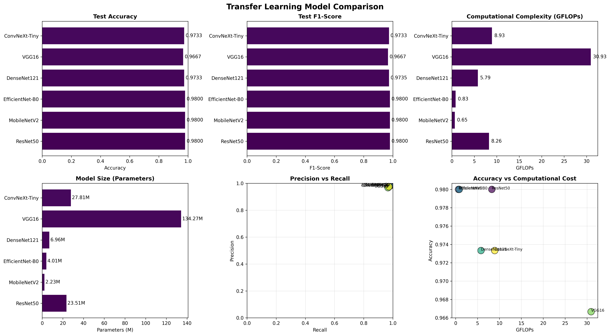
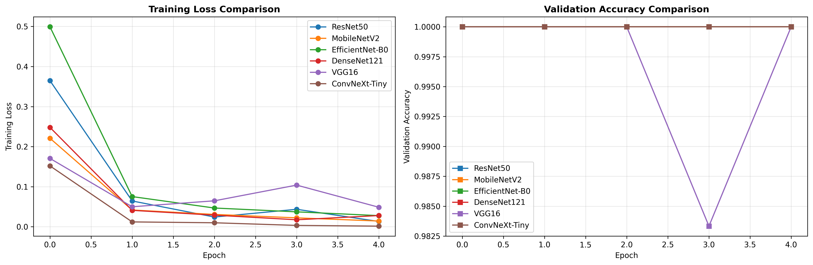

# Edge-Efficient Knowledge-Distilled Plant Disease Detection

An efficiency-focused plant-disease image-classification project that studies whether a **ConvNeXt V2-Inspired Teacher** can supervise a lightweight MobileNetV2 student during training while retaining MobileNetV2-level deployment cost.

## Overview

The task is three-class plant-disease classification: `Healthy`, `Powdery`, and `Rust`. The final deployable model is a MobileNetV2 student. The teacher is used only to provide logits during knowledge-distillation training; it is not part of the inference architecture.

The repository preserves the completed experimental record and its published comparison. It is intended for inspection and reproducibility of the recorded workflow, not as a claim that every notebook can be run end-to-end without its original environment and checkpoints.

## Pipeline

```text
Plant Disease Images
        |
        +--> MobileNetV2 baseline (trained independently)
        |
        v
ConvNeXt V2-Inspired Teacher
        |
        | teacher logits during training
        v
MobileNetV2 student
        |
        v
Lightweight distilled classifier for inference
```

## Models

- **MobileNetV2 baseline:** trained with hard-label cross-entropy.
- **ConvNeXt V2-Inspired Teacher:** a torchvision ConvNeXt-Tiny backbone with a GRN-inspired classification head. It is not an official or full ConvNeXt V2 implementation.
- **Distilled MobileNetV2:** MobileNetV2 trained with teacher supervision. Its deployed architecture remains MobileNetV2.

## Knowledge distillation

The recorded implementation combines hard-label cross-entropy with temperature-scaled KL divergence between student and teacher logits:

`L = alpha * L_CE + (1 - alpha) * T^2 * L_KL`

The retained main notebook records `alpha = 0.7` and `T = 4.0`. The teacher is frozen during student training.

## Dataset

The project uses a three-class plant-disease dataset with `Healthy`, `Powdery`, and `Rust` classes. The retained split contains 1,322 training images, 60 validation images, and 150 test images. Images are resized to 224 x 224 in the main workflow.

The dataset is deliberately not included. Place a compatible dataset locally as:

```text
plant_dataset/
├── Train/Train/{Healthy,Powdery,Rust}/
├── Validation/Validation/{Healthy,Powdery,Rust}/
└── Test/Test/{Healthy,Powdery,Rust}/
```

The original dataset source and license were not retained in the project files.

## Final reported comparison

The following values are taken directly from [`results/metrics/final_3_model_comparison.csv`](results/metrics/final_3_model_comparison.csv). Latency is the recorded per-image inference time on the original environment.

| Model | Accuracy | Precision | Recall | F1 | Parameters (M) | GFLOPs | Latency (ms) | Model size (MiB) |
|---|---:|---:|---:|---:|---:|---:|---:|---:|
| MobileNetV2 baseline | 98.00% | 0.980644 | 0.980000 | 0.979854 | 2.227715 | 0.312917 | 10.507 | 8.728 |
| ConvNeXt V2-Inspired Teacher | 97.33% | 0.974188 | 0.973333 | 0.973319 | 27.823971 | 4.469672 | 36.628 | 106.207 |
| Distilled MobileNetV2 | 98.00% | 0.980644 | 0.980000 | 0.979854 | 2.227715 | 0.312917 | 9.694 | 8.729 |

Baseline MobileNetV2 and distilled MobileNetV2 both report 98% accuracy. They have the same architecture-level parameter count and GFLOPs; knowledge distillation does not reduce those quantities relative to the baseline. Compared with the teacher, the recorded distilled model retains MobileNetV2-level efficiency.

The repository also retains an earlier KD record reporting 97.33% test accuracy in `hybrid_model_efficiency_metrics.csv`. The available files do not fully resolve why this differs from the final comparison, so it is documented as an experimental-provenance limitation rather than hidden or replaced.

## Figures

The retained figures support the separate six-model transfer-learning experiment.





## TPE / Optuna

Notebook history references Optuna objects, but the available files do not retain a TPE optimization implementation, trial history, parameter search space, or recoverable results. This repository therefore makes no claim about TPE outcomes.

## Installation and use

```bash
python -m venv .venv
.venv\\Scripts\\activate
pip install -r requirements.txt
jupyter lab
```

Open `notebooks/experiments.ipynb` to inspect the baseline, ConvNeXt V2-Inspired Teacher, and distillation workflow. Open `notebooks/transfer_learning_comparison.ipynb` for the separate six-model comparison. Running either notebook may require the original dataset, compatible PyTorch environment, cached pretrained weights, and checkpoints; no retraining is required to browse the saved outputs.

`ollama_helper.py` is optional. It calls a local Ollama server to turn a predicted class and confidence score into agricultural guidance; it is not used for classifier evaluation.

## Repository structure

```text
publication/
├── README.md
├── PROJECT.md
├── requirements.txt
├── .gitignore
├── ollama_helper.py
├── notebooks/
│   ├── experiments.ipynb
│   └── transfer_learning_comparison.ipynb
├── results/
│   ├── figures/
│   └── metrics/
└── paper/
    └── edge_efficient_knowledge_distilled_plant_disease_detection.pdf
```

## Paper

The completed paper is available at [`paper/edge_efficient_knowledge_distilled_plant_disease_detection.pdf`](paper/edge_efficient_knowledge_distilled_plant_disease_detection.pdf).

## Limitations and future work

The recorded evaluation uses a small three-class dataset and hardware-specific latency measurements. The final records demonstrate preservation of reported MobileNetV2 performance, not an accuracy increase from KD. Future work could evaluate broader plant-disease datasets, repeat benchmarks on target edge hardware, retain full experiment provenance, and extend the optional advisory component with region-specific and multilingual guidance.

## References

The accompanying paper cites MobileNetV2 (Sandler et al., 2018), ConvNeXt (Liu et al., 2022), ConvNeXt V2 (Woo et al., 2023), knowledge distillation (Hinton et al., 2015), and the other transfer-learning architectures used in the comparative experiment.
